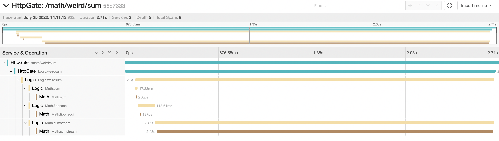

[](https://coveralls.io/github/lad-tech/nsc-toolkit?branch=main)
[](https://snyk.io/test/github/lad-tech/nsc-toolkit)

# nsc-toolkit

Содержание
- [nsc-toolkit](#nsc-toolkit)
  - [О библиотеке](#о-библиотеке)
  - [Возможности](#возможности)
  - [Установка](#установка)
  - [Быстрый старт](#быстрый-старт)
    - [Переменные окружения](#переменные-окружения)
  - [Основные компоненты библиотеки](#основные-компоненты-библиотеки)
  - [Рекомендации](#рекомендации)
  - [Пример использования](#пример-использования)
    - [Описание каталога `examples`](#описание-каталога-examples)
  - [Сворачивание сервисов в монолитное приложение](#сворачивание-сервисов-в-монолитное-приложение)
  - [Инверсия зависимостей и DI-контейнер](#инверсия-зависимостей-и-di-контейнер)

## О библиотеке

`nsc-toolkit (NATS service creator toolkit)` 一 это набор инструментов для создания сервис-ориентированной архитектуры.

Основная идеология тулкита заключается в установке минимального количества зависимостей, что позволяет создавать сервисы с помощью инструментов кодогенерации на основе простого описания в JSON-формате.

Основным средством коммуникации между сервисами в обычном режиме работы является брокер сообщений [NATS](https://nats.io/). Применяются четыре основных способа:

1. Синхронный (`request`/`reply`) через брокер сообщений. Используется, если одному сервису, чтобы продолжать выполнять свою логику, требуются данные из другого сервиса.
2. События (`pub`/`sub`). События используются, когда сервису необходимо оповестить другие сервисы о произошедшем событии, но кто слушает и обрабатывает эти события, сервису неизвестно. Это дает возможность строить независимые между собой сервисы для создания архитектуры на основе событий 一 Event-driven architecture (EDA).
3. Web-потоки на основе `HTTP 1.1`. Этот метод используется, если сервису требуется передать в другой сервис поток данных. Например, список из миллиона пользователей или любые другие объемные данные, включая бинарные. Тогда брокер выступает только как средство для балансировки нагрузки и не участвует в передаче данных напрямую. Данные передаются с помощью web-потока из одного сервиса в другой через прямое соединение. Метод сервиса в качестве входных параметров может принимать поток данных и отдавать его в качестве ответа.
4. Jet-streams используют возможности брокера NATS. Jet-streams похожи на `pub`/`sub`, но предоставляют возможность хранить сообщения на самом брокере. Такой тип коммуникации позволяет реализовывать более безопасный способ общения между сервисами на основе событий. События, если на них нет подписчиков на текущий момент, не пропадут, а сохранятся на самом брокере.

Все четыре способа коммуникации между сервисами реализуются средствами библиотеки и описываются в JSON.

## Возможности

- Простота и минимальное количество зависимостей за счет снижения уровня вариативности
- Схема взаимодействия `request`/`reply`
- Схема взаимодействия `pub`/`sub`
- Использование Web-streams
- Использование Jet-streams
- Сквозной таймаут для запросов
- Трассировки
- Межсервисное кеширование
- Валидация входных и выходных параметров методов сервиса на основе [JSON Schema](https://json-schema.org/).
- Логирование с учетом контекста
- Декораторы для инъекции зависимостей в методы сервиса
- Сервисный http-маршрут для проб, который поднимается вместе со стартом сервиса (доступен `GET [host]/healthcheck HTTP/1.1`)
- Сворачивание написанных сервисов в монолитное приложение без использования брокера NATS с сохранением всего спектра перечисленных функциональностей. Разные типы архитектуры (микросервисы или монолит) собираются из одной кодовой базы. Это может происходить параллельно в одном пайплайне CI/CD.

## Установка

```
npm i @lad-tech/nsc-toolkit
```

## Быстрый старт

Для обзора возможностей библиотеки рекомендуется использовать пример из каталога `examples`, который состоит из 3-х сервисов. Подробно реализация логики описана в пункте [Пример использования](#пример-использования).

Чтобы запустить пример, необходимо:

1. клонировать репозиторий с библиотекой и установить зависимости:

```
npm i
```

2. дополнительно зайти в каталог `examples` с сервисом `HttpGate`

```
cd ./examples/HttpGate
```

и установить там зависимости, так как для реализации HTTP-API используется библиотека Fastify:

```
npm i
```

3. после установки зависимостей можно запустить сервисы.

Список всех зависимостей можно посмотреть [тут](https://www.npmjs.com/package/@lad-tech/nsc-toolkit?activeTab=dependencies).

### Переменные окружения

- `DEFAUL_RESPONSE_TIMEOUT` 一 внешнее ограничение тайм-аута при запросе в секундах. Используется при первоначальном формировании времени тайм-аута в багаже по формуле `Date.now() + DEFAULT_RESPONSE_TIMEOUT`;
- `OTEL_AGENT` 一 хост агента по сбору распределенных трассировок.

## Основные компоненты библиотеки

Основные компоненты библиотеки хранятся в каталоге `src`. То, что не перечисленно в описании ниже, недоступно для использования и применяется только во внутреннем устройстве библиотеки.

Для реализации сервисов используются следующие компоненты.

1. Файл `service.schema.json`. Каждый сервис описывается в формате json. 

Ниже представлена схема описания.

```json
{
  "$schema": "http://json-schema.org/draft-04/schema#",
  "type": "object",
  "properties": {
    "name": {
      "type": "string"
    },
    "description": {
      "type": "string"
    },
    "methods": {
      "type": "object",
      "additionalProperties": {
        "type": "object",
        "properties": {
          "action": { "type": "string" },
          "description": { "type": "string" },
          "options": { "$ref": "#/$defs/options" },
          "request": { "type": "object" },
          "response": { "type": "object" }
        },
        "required": ["action", "description", "options"]
      }
    },
    "events": {
      "type": "object",
      "properties": {
        "list": {
          "type": "object",
          "additionalProperties": {
            "type": "object",
            "properties": {
              "action": { "type": "string" },
              "options": {
                "type": "object",
                "properties": {
                  "stream": { "type": "boolean" }
                },
              },
              "description": { "type": "string" },
              "event": { "type": "object" }
            },
            "required": ["action", "description", "event"]
          },
        },
        "streamOptions": {
          "type": "object",
          "properties": {
            "prefix": { "type": "string" },
            "actions": {
              "type": "array",
              "items": {
                "type": "object",
                "properties": {
                  "action": { "type": "string" },
                  "storage": { "type": "string" },
                  "retentionPolicy": { "type": "string" },
                  "discardPolicy": { "type": "string" },
                  "messageTTL": { "type": "number" },
                  "duplicateTrackingTime": { "type": "number" },
                  "replication": { "type": "number" },
                  "rollUps": { "type": "boolean" }
                },
                "required": ["action"]
              }
            }
          },
          "required": ["prefix", "actions"]
        }
      },
      "required": ["list"]
    }
  },
  "required": ["name", "description", "methods"],

  "$defs": {
    "options": {
      "type": "object",
      "properties": {
        "useStream": {
          "type": "object",
          "properties": {
            "request": { "type": "boolean" },
            "response": { "type": "boolean" }
          }
        },
        "cache": { "type": "number" },
        "runTimeValidation": {
          "type": "object",
          "properties": {
            "request": { "type": "boolean" },
            "response": { "type": "boolean" }
          }
        }
      }
    }
  }
}
```

Пояснения к схеме:
- `name` 一 название сервиса;
- `description` 一 описание сервиса;
- `methods` 一 набор методов для реализации схемы `request`/`reply`;
  - `action` 一 идентификатор запроса;
  - `description` 一 описание метода;
  - `request` 一 JSON Schema входных данных;
  - `response` 一 JSON Schema выходных данных;
  - `options` 一 настройки метода;
    - `useStream` 一 использование Web-стримов для входных и выходных данных;
      - `request` 一 Web-стрим на входе;
      - `response` 一 Web-стрим на выходе;
    - `cache` 一 кеширование запроса (задается в минутах);
    - `runTimeValidation` 一 использование runtime для валидации параметров;
      - `request` 一 для входных данных;
      - `response` 一 для выходных данных;
- `events` 一 набор событий, генерируемый сервисом для реализации схемы `pub`/`sub`;
  - `list` 一 массив объектов событий, генерируемых сервисом;
    - `action` 一 идентификатор события;
    - `description` 一 описание события;
    - `options` 一 необязательные настройки события;
      - `stream` 一 булевый флаг, маркирующий, что событие является стримом;
    - `event` 一 JSON Schema события;
  - `name` 一 идентификатор события;
  - `description` 一 описание события;
  - `event` 一 JSON Schema события;
- `streamOptions` 一 настройки стрима;
  - `prefix` 一 префикс ко всем темам, у которых включена опция `stream: true`;
  - `actions` 一 массив объектов настроек стримов;
    - `action` 一 паттерн для тем, на которые будут применяться данные настройки (если указана `*`, то применяется ко всем событиям с опцией `stream: true`);
    - `storage` 一 хранилище для сообщений стрима (доступные варианты `file`|`memory`, по умолчанию `file`);
    - `retentionPolicy` 一 по каким правилам будут удаляться сообщения из стрима (доступные варианты `limits`|`interest`|`workQueue`, по умолчанию `limits`);
    - `discardPolicy` 一 определяет, какие сообщения будут отброшены при достижении лимита (доступные варианты `old`|`new`, по умолчанию `old`);
    - `messageTTL` 一 срок жизни сообщения (задается в секундах, по умолчанию 2 недели);
    - `duplicateTrackingTime` 一 временной отрезок, на котором работает дедубликация сообщений (задается в секундах, по умолчанию 1 день);
    - `replication` 一 количество реплик стрима (по умолчанию 1);
    - `rollUps` 一 флаг, разрешающий удалить все сообщения из стрима (по умолчанию `true`).

Файл позволяет описать все возможности создаваемого сервиса:
  - синхронные методы;
  - генерируемые сообщения;
  - настройки стримов для сообщений. 
  
Сервис предполагается создавать из описания с помощью кодогенерации. Используется библиотека для кодогенерации сервиса из описания [nsc-cli](https://github.com/lad-tech/nsc-cli).

2. Класс `Service`. Чтобы создать сервис, необходимо создать экземпляр этого класса и вызвать метод `start`.

Принимаемые параметры при создании экземпляра:

- `name` 一 имя сервиса.
- `brokerConnection` 一 необязательный параметр для подключения к брокеру NATS. Если его не передать, то будет использоваться внутренняя реализация брокера, и приложение будет собираться в монолит. 
- `methods` 一 массив методов. `BaseMethod` это один из базовых классов библиотеки, который необходимо расширить, чтобы создать метод с бизнес-логикой.
- `events` 一 описание генерируемых событий. Следует передать весь блок `events` из `service.schema.json`.
- `cache` 一 настройки межмикросервисного кеширования.
  - `service` 一 реализация интерфейса для сервиса кеширования;
  - `timeout` 一 время, в рамках которого необходимо ожидать ответа от кеша (задается в миллисекундах).
- `loggerOutputFormatter` 一 реализация класса форматера для логов. Для логирования используется библиотека [@lad-tech/toolbelt](https://github.com/lad-tech/toolbelt).
- `gracefulShutdown` 一 настройки по завершению работы сервиса.
  - `additional` 一 массив дополнительных сервисов, которые могут завершать свою работу. Необходим, чтобы сервисы реализовывали нужный интерфейс.
  - `timeout` 一 время, в рамках которого ожидается штатная остановка сервиса.

Публичные методы:

- `getRootBaggage` 一 получение корневого багажа для распределенной трассировки. Источником могут служить заголовки http-запроса. Если подобные источники отсутствуют, то создается новый корневой багаж.
- `endRootSpan` 一 завершение корневого `Span` по `id` трассировки. Необходим для внедрения распределенных трассировок.
- `buildService` 一 метод, чтобы создать экземпляр клиента. Все используемые при запросах клиенты (сервисы) должны создаваться через этот метод, если необходимо использовать полную функциональность библиотеки.
- `start` 一 запуск сервиса.
- `stop` 一 остановка сервиса.

3. Класс `Client`. Чтобы создать клиент для сервиса, необходимо расширить класс `Client` и описать в нем все доступные извне вызовы методов. Для вызова метода используется приватный метод `CLient.request`. Пример создания клиента можно [посмотреть тут](./examples/MathService/index.ts).

Публичные методы:

- `getListener` 一 метод получения объекта `EventEmitter` для подписки на события сервиса.

4. Класс `Container`. Реализует DI-контейнре. Сам класс не доступен для импорта, а доступен только его экземпляр, что позволяет реализовать шаблон Singlton. В микросервисном варианте контейнер один на сервис. В монолитном варианте использования контейнер один на все приложение. За счет использользования объектов Symbol в качестве ключей для привязки зависимостей исключены коллизии при привязки зависимостей в разных частях приложения через один контейнре. Для привязки зависимости к ключу необходимо указать тип зависимости. Это нужно чтобы библиотека могла корректно создать ээкземпляр зависимости. Всего существуют 3 вида зависимостей:

- `service` 一 сервис как зависимости.
- `adapter` 一 класс с набором асинхронных методов. Например репозиторий или фасад от стороннего API.
- `constant`一 обычный объект. Например объект с конфигурацией.

Публичные методы:

- `bind` 一 привязать реализацию к ключу.
- `unbind` 一 отвязать реализацию от ключа.
- `get` 一 получить реализацию по ключу.
- `getInstance` 一 получить экземпляр реализации. Для зависимости с типом `service` нельзя получить экземпляр через этот метод поскольку для создания экземпляра сервиса требуется контекст в рамках которого он будет работать. Для зависимости с типом `constant` вернется привязанный объект. 

5. Декораторы. Применение декораторов:
* `@service`:
  - Если в методе сервиса вызывается метод другого сервиса, то клиент сервиса зависимости следует подключить через декоратор `@service`, а к самому классу метода применить декоратор `@related`. Тогда при вызове метода сервиса не пропадет контекст запроса и можно будет использовать распределенные трассировки. 
  - Инъекция через декоратор `@service` позволяет использовать функциональность сборки приложения в монолит. 
* `@instance`:  
  - Используется для инъекции других зависимостей, например, объектов репозиториев. В него можно передать готовый объект с набором асинхронных методов. При вызове этих методов из его логики они будут видны в трассировках. Для получения таких зависимостей рекомендуется использовать DI-контейнеры.

## Рекомендации

Библиотека задумана как инструмент, не диктующий жестких правил, однако предлагается следовать следующим рекомендациям. 

- Использовать кодогенерацию на основе описания сервиса в файле `service.schema.json` с помощью библиотеки [nsc-cli](https://github.com/lad-tech/nsc-cli). На основе описания будут автоматически сгенерированы сервис, клиент, методы и все интерфейсы. В результате весь шаблонный код будет написан и можно сразу приступать к написанию бизнес-логики. Для изменения сервиса (например, добавления нового метода, события или параметров запроса) следует в первую очередь изменить файл описания `service.schema.json`, а затем перегенерировать сервис на его основе. Уже написанная логика не пропадет, но все изменения будут учтены в коде.

- Описывать структуру сервиса. Ниже представлена декларативная структура сервиса следующего вида.

```
Service/
├── domain/
│   ├── aggregates/
│   │   ├── Aggregate_1/
│   │   │   ├── fixtures/
│   │   │   │   ├── fixture_1.json
│   │   │   │   ├── fixture_1.json
│   │   │   │   └── ...
│   │   │   ├── Aggregate.ts
│   │   │   ├── Aggregate.interface.ts
│   │   │   ├── Aggregate.test.ts
│   │   │   └── index.ts
│   │   └── Aggregate_2/
│   │       ├── fixtures/
│   │       │   ├── fixture_1.json
│   │       │   ├── fixture_1.json
│   │       │   └── ...
│   │       ├── Aggregate.ts
│   │       ├── Aggregate.interface.ts
│   │       ├── Aggregate.test.ts
│   │       └── index.ts
│   └── ports/
│       ├── index.ts
│       └── repository.ts
├── methods/
│   ├── Method_1/
│   │   ├── index.ts
│   │   ├── index.test.ts
│   │   └── ...
│   ├── Method_2/
│   │   ├── index.ts
│   │   ├── index.test.ts
│   │   └── ...
│   └── ...
├── repository/
│   └── index.ts
├── index.ts
├── interfaces.ts
├── service.ts
├── start.ts
├── inversion.types
├── service.schema.json
├── package.json
├── package-lock.json
└── tsconfig.json
``` 

Пояснения к структуре:

  - `domain` 一 каталог, который содержит в себе все классы предметной области сервиса и интерфейсы портов, необходимых для ее работы;
    - `aggregates` 一 каталог с агрегатами предметной области;
      - `Aggregate` 一 каталог агрегата (например, `User`);
        - `Aggregate.ts` 一 класс агрегата;
        - `Aggregate.interface.ts` 一 интерфейсы агрегата (например, интерфейс параметров для создания экземпляра агрегата или интерфейс представления агрегата);
        - `Aggregate.test.ts` 一 тесты для агрегата;
        - `fixtures` 一 фикстуры для тестирования агрегата;
        - `index.ts` 一 реэкспорт агрегата и его интерфейсов;
    - `ports` 一 каталог, который содержит интерфейсы для всех необходимых логике портов;
      - `repository.ts` 一 файл с интерфейсом необходимого репозитория для хранения агрегатов (для примера);
      - `index.ts` 一 реэкспорт портов и его интерфейсов;
    - `methods` 一 каталог с синхронными методами сервиса (генерируется автоматически);
      - `Method_1` 一 каталог метода;
        - `index.ts` 一 класс метода;
        - `index.test.ts` 一 тесты для метода;
      - `repository` 一 реализация репозитория на основе порта;
    - `index.ts` 一 файл клиента сервиса (генерируется автоматически);
    - `interfaces.ts` 一 интерфейсы сервиса (генерируется автоматически);
    - `service.ts` 一 реализация сервиса (генерируется автоматически);
    - `start.ts` 一 точка входа для запуска сервиса (генерируется автоматически);
    - `inversion.types.ts` 一 Типы зависимостей используемые в логике сервиса. Типы используются для получения зависимости. Реализация требуемой зависимости привязывается к контейнеру через тип в файле сервиса. [Описание встроенных возможностей инверсии зависимостей](#инверсия-зависимостей-и-di-контейнер).
    - `service.schema.json` 一 описание сервиса.

Вся бизнес-логика сконцентрирована в двух местах структуры:

- Агрегаты предметной области. В методах агрегатов содержится чистая бизнес-логика.
- Методы сервиса. Методы содержат часть бизнес-логики сервиса и конкретного метода сервиса, а также служат связующим звеном бизнес-логики агрегата и портов.

## Пример использования

Пример использования инструментов тулкита находится в каталоге `examples`.

Все три сервиса созданы для реализации тестовой логики "Странная сумма":

1. Во вход необходимо передать два числа `a` и `b`.
2. На первом этапе логика сервисов сложит эти два числа между собой. Полученная сумма будет использована в качестве максимального количества чисел из ряда Фибоначчи.
3. На последнем этапе, получив последовательность чисел, логика сложит их между собой и вернет ответ.

### Описание каталога `examples`

1. `HttpGate` 一 cервис предоставляет http api с одним маршрутом `POST /math/weird/sum`. В качестве тела запроса необходимо передать json. Например:

```json
{
  "a": 5,
  "b": 5
}
```

После получения запроса сервис `HttpGate` синхронно через брокер вызывает сервис `Logic` и, получив от него ответ, возвращает результат в качестве ответа на запрос.

2. `LogicService` 一 сервис реализует логику "Странной суммы". Сам сервис ничего не вычисляет, а использует другой сервис `MathService`:

- Получив два числа от `HttpGate`, `LogicService` синхронно вызывает метод сервиса `Math.sum`, который складывает два переданных числа.
- Затем сервис вызывает метод `Math.Fibonnacci`, в который передает результат предыдущего действия и в качестве ответа получает поток с числами Фибоначчи.
- Получив поток чисел, сервис передает этот поток в метод `Math.SumStream`, который складывает все числа в потоке и в ответе возвращает одно число, которое и является "Странной суммой".
- В конце последней операции сервис генерирует событие `Elapsed`, в которое передает затраченное на выполнение вычислений время.

3. `MathService` 一 сервис реализует 3 метода: `Sum`, `Fibonacci` и `SumStream`, описанные выше. Помимо этих методов, сервис генерирует также два события:

- При вызове метода `SumStream` сервис генерирует обычное событие `Notify`.
- После завершения вычислений сервис генерирует событие `Elapsed`, в которое передает затраченное на выполнение вычислений время. Событие `Elapsed` описано как Jet-stream.

В результате запросов к тестовым сервисам генерируются трассировки следующего вида:




## Сворачивание сервисов в монолитное приложение

Библиотека поддерживает возможность сворачивать микросервисы в одно монолитное приложение. Чтобы реализовать эту возможность, необходимо придерживаться [рекомендаций](#рекомендации). 

Для сворачивания в монолит необходимо использовать отдельную точку входа в приложение. Она должна находиться в сервисе, предоставляющем внешнее API к методам приложения. 

Логика точки входа в монолитную версию приложения: 
- Создается экземпляр сервиса без передачи в него подключения к NATS. В таком случае вместо NATS в качестве брокера будет использована внутренняя реализация брокера на основе встроенного объекта `EventEmitter`. Доступ в созданному брокеру можно получить через открытое свойство сервиса `broker`.
- После создания корневого сервиса необходимо запустить остальные сервисы, передав полученный брокер корневого сервиса. За счет этого все сервисы приложения будут использовать один внутренний брокер. При создании клиентов и при использовании инъекций также будет использован этот брокер. Единый внутренний брокер свяжет дерево сервисов в одно приложение и позволит запустить весь код сервисной архитектуры в монолитном режиме. 

Пример точки входа для монолитного режима и скрипт сборки можно посмотреть в каталоге `examples`: [точка входа](./examples/HttpGate/start.mono.ts). 

```
        ┌───────────┐
        │ HTTP_GATE │
        └─────┬─────┘
    ┌─────────┴─────────┐
┌───┴───┐         ┌─────┴─────┐
│ Logic │         │ Service_1 │
└───┬───┘         └─────┬─────┘
    │            ┌──────┴───────┐
 ┌──┴───┐  ┌─────┴─────┐  ┌─────┴─────┐
 │ Math │  │ Service_2 │  │ Service_3 │
 └──────┘  └───────────┘  └───────────┘
```

## Инверсия зависимостей и DI-контейнер

Библиотека реализует возможности по инверсии зависимостей через DI-контейнер. Экземпляр контейнера можно получить импортировав его из библиотеки. Для описания существующих ключей зависимостей рекомендуется использовать отдельный файл `inversion.types.ts` в корне сервиса. [Пример файла](./examples/LogicService/inversion.types.ts). Для внедрения зависимостей используются свойства класса метода или параметры конструктора. Для описания зависимости используется декоратор `inject`, который можно импортировать из библиотеки. В декоратор необходимо передать символьный ключ из файла `inversion.types.ts`. Саму привязку реализаций к DI-контейнеру рекомендуется осуществлять в основном файле сервиса `service.ts`. Пример с глубоко вложенными зависимостями разных типов можно [посмотреть в методе](./examples/LogicService/methods/GetUser.ts). Цепочка внедряемых зависимостей.

```
┌---------┐    ┌───────────-┐    ┌───────────---┐    ┌---------┐
| GetUser |--->│ Repository |--->| Configurator |--->| Storage |
└---------┘    └─────-─────-┘    └─────-─────---┘    └---------┘
```